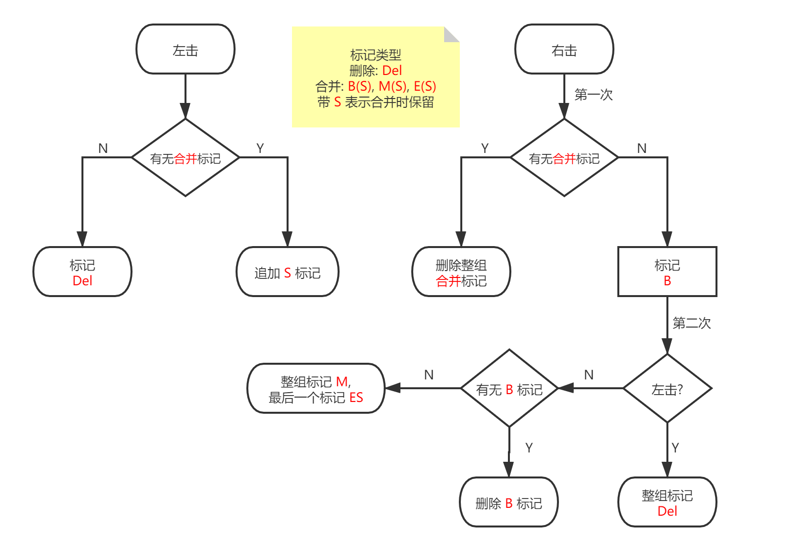

# Caption OCR Tool (abbr. COCR)

 

## 目录
- [简介](#简介)
- [系统需求](#系统需求)
- [基本使用](#基本使用)
- [模块说明](docs/MODULE_ZH_CN.MD)
- [开发](#开发)
- 其他语言
  - [English](docs/README_EN.MD)
  - [繁體中文](docs/README_ZH_TW.MD)

## 简介

一款 视频硬字幕提取 的工具, 使用 OpenCV 进行视频/图像处理, 再利用 Tesseract-OCR 识别.

COCR 提供 HSV, HLS, 二值形态学的过滤方法, 对于颜色偏暗的场景, 二值形态学比色彩过滤效果更佳.

## 系统需求

|项目|最低配置|
|-|-|
|操作系统|Windows 7 x64|
|CPU|2C2T|
|内存|4 GB|
|GPU 显存|2 GB|
|空闲空间|500 MB|

## 基本使用

1. 打开视频文件, 并点击 *滤镜*.

1. 选择一个模块配置, **重点: 调整 "裁剪" 模块中的字幕区域, 不要搞错左上角和右下角的位置!**.

    注: 滤镜最后得到的图像应该是白底黑字的!!

    - 如果不是黑白的二值图像, 调整你的滤镜模块和参数;

    - 如果是黑字白底, 需要加一个 "反转" 模块;

1. 关闭 *滤镜* 窗口后, 主窗口点击 *开始* 提取字幕.

1. 开启 *管理模式*, 标记无效的字幕, 并点击 *删除&合并*.

1. 点击 *OCR* 识别字符, 或者使用 *导出* 图像后利用其他软件 OCR.

1. 对文本进行校准, 点击 *另存为* 保存字幕文件.

### 其他

- 遇到错误提示, 查 [模块说明](docs/MODULE_ZH_CN.MD) 或 [Google](https://google.com), 确保参数是合法的; 提交 Issue 的时候带上具体错误信息, 在 log 中可以找到.

- 启动闪屏可更换图片, 把 jpg/png 格式的图片放到安装目录下的 *splash* 文件夹中.

- 删除&合并操作逻辑



## 开发

### 依赖

- JDK 11+

- Maven 3.0+

- Lombok

- JavaFX jmods 11+ (生成 JRE Runtime 需要)

### 编译

克隆源码

```
git clone https://github.com/sum1re/caption_ocr_tool.git
```

打开 *caption_ocr_tool* 文件夹, 安装 OpenCv.jar

```
mvn install:install-file -Dfile=lib/opencv-420.jar -DgroupId=org.opencv -DartifactId=opencv -Dversion=4.2.0 -Dpackaging=jar -DgeneratePom=true
```

IDEA 或其他软件导入项目, 下载依赖后编译

```
mvn compile
```

运行需要指定 JVM 参数

```
-server -Xmx4g -Dfile.encoding=utf-8 -Dcocr.dir=$ProjectFileDir$/cocr_setup_win/app -Djava.library.path=$ProjectFileDir$/lib -Dprism.targetvram=2G -Dprism.vsync=false -Dprism.scrollcacheopt=true -Djavafx.preloader=com.neo.caption.ocr.AppPreloader
```

项目使用 *Github Actions* 打包并发布 ***Windows*** 安装程序

### 其他

- Tesseract-OCR LSTM 训练, 参考[官方手册](https://tesseract-ocr.github.io/tessdoc/TrainingTesseract-4.00)

- 关于 Test, 由于项目基于 SpringBoot + JavaFX, 完全不知道如何 Test.

- 构建 JRE Runtim

  ```
  jlink --module-path jmods/path --add-modules MODULE_LIST --compress 2 --strip-debug --output out/path/runtime
  ```

- JRE Runtime 需要包含的 Module

  ```
  java.base,java.instrument,java.sql,jdk.unsupported,java.compiler,java.logging,java.desktop,java.naming,java.xml,java.prefs,java.management,java.rmi,java.scripting,jdk.httpserver,javafx.base,javafx.controls,javafx.fxml,javafx.graphics
  ```
