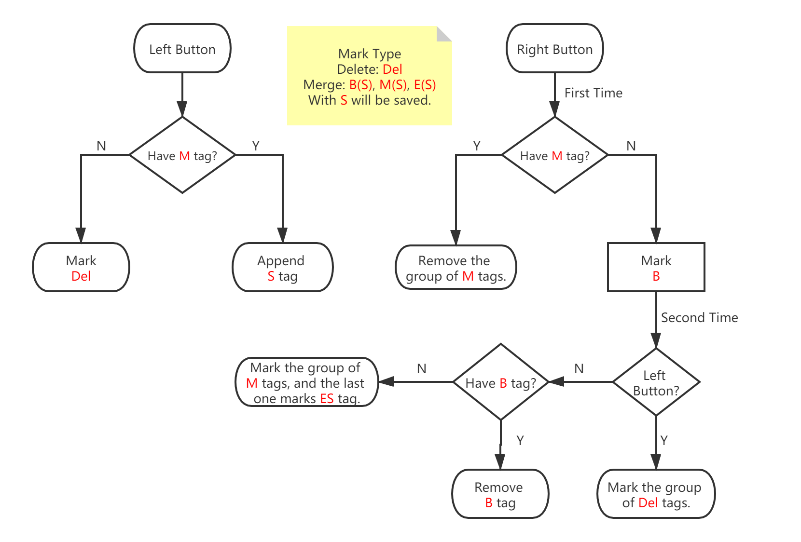

# Caption OCR Tool (abbr. COCR)

 

## Contents
- [Introduction](#Introduction)
- [Minimum_Requirements](#Minimum_Requirements)
- [Usage](#Usage)
- [Module](MODULE_EN.MD)
- [Develop](#Develop)
- Other language
  - [简体中文](../README.MD)
  - [繁體中文](README_ZH_TW.MD)

## Introduction

A tool to extract video caption, using OpenCV to process the video and image, then using Tesseract-OCR to recognize the text.

COCR supports the HSV, HLS, binary morphology to filter the text. For dark scenes, binary morphology is better than HLS or HSV.

## Minimum_Requirements

|Item|Minimum Requirements|
|-|-|
|Operating system|Windows 7 x64|
|CPU|2C2T|
|Memory|4 GB|
|GPU Memory|2 GB|
|Free space|500 MB|

## Usage

1. Open a video file, and click the *Filter* button.

1. Select a module profile. **Important: Adjust the caption area in the *CROP* module, do not make the mistake with the position of the Upper-Left and Lower-Right!**

  PS: The last image of the filter should be black on white!!

    - If it is not black and white, adjust your modules or parameters

    - If it is white on black, you need to add an *INVERT* module

1. Close the *Filter* window, and click the *Start* button on the main window to extract the caption.

1. Check *Manager Mode*, mark the image that you do not need, and click the *Del&Merge* button.

1. Click the *OCR* button to do optical character recognition, or you can click the *export* button to export an image and use other software to finish this task.

1. Calibrate the text, then click *Save As* button to save the caption file.

### Other

- An error dialog? Read the [Module](MODULE_EN.MD) file or [Google](https://google.com) to ensure that the parameters are valid. When submitting an issue, do not forget to give the full information which can be found in the log file.

- Other exception? If it has a detailed message, refer to the previous suggestion, else you may need to submit a new issue.

- How to change the splash? Copy a jpg/png picture to the *splash* folder under the installation directory.

The flowchart for *Del & Merge*



## Develop

### Dependency

- JDK 11+

- Maven 3.0+

- Lombok

- JavaFX jmods 11+ (To build JRE Runtime)

- Inno Setup (Windows)

### Compile

clone project

```
git clone https://github.com/sum1re/caption_ocr_tool.git
```

Open the *caption_ocr_tool* folder, install OpenCv.jar

```
mvn install:install-file -Dfile=lib/opencv-420.jar -DgroupId=org.opencv -DartifactId=opencv -Dversion=4.2.0 -Dpackaging=jar -DgeneratePom=true
```

Open this project by IDE, compile it.

```
mvn compile
```

Some JVM options are necessary to run this project.

```
-server -Xmx4g -Dfile.encoding=utf-8 -Dcocr.dir=$ProjectFileDir$/cocr_setup_win/app -Djava.library.path=$ProjectFileDir$/lib -Dprism.targetvram=2G -Dprism.vsync=false -Dprism.scrollcacheopt=true -Djavafx.preloader=com.neo.caption.ocr.AppPreloader
```

Use *Inno Setup* to compile the installer for ***Windows***.

1. Package the jar file.

  ```
  mvn -Djavacpp.platform=windows-x86_64 package
  ```

1. Create the installer file.

  ```
  iscc cocr_iss/cocr.iss
  ```

### Other

- Train Tesseract-OCR LSTM? You need to read [tessdoc](https://tesseract-ocr.github.io/tessdoc/TrainingTesseract-4.00).

- About Test. Because this project uses SpringBoot and JavaFX, so I have no idea how to test.

- Build JRE Runtime

  ```
  jlink --module-path jmods/path --add-modules MODULE_LIST --compress 2 --strip-debug --output out/path/runtime
  ```

- JRE Runtime should include these Modules.

  ```
  java.base,java.instrument,java.sql,jdk.unsupported,java.compiler,java.logging,java.desktop,java.naming,java.xml,java.prefs,java.management,java.rmi,java.scripting,jdk.httpserver,javafx.base,javafx.controls,javafx.fxml,javafx.graphics
  ```
