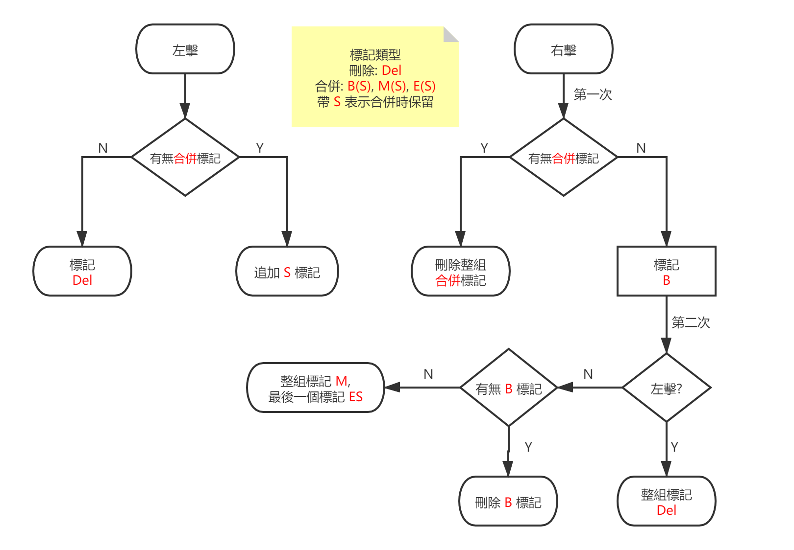

# Caption OCR Tool (abbr. COCR)

 

## 目錄
- [簡介](#簡介)
- [系統需求](#系統需求)
- [基本使用](#基本使用)
- [模組說明](MODULE_ZH_TW.MD)
- [開發](#開發)
- 其他語言
  - [English](README_EN.MD)
  - [简体中文](../README.MD)

## 簡介

一款 影片硬字幕提取 的工具, 使用 OpenCV 進行視訊/圖像處理, 再利用 Tesseract-OCR 識別.

COCR 提供 HSV, HLS, 二值形態學的過濾方法, 對於顏色偏暗的場景, 二值形態學比色彩過濾效果更佳.

## 系統需求

|項目|最低配置|
|-|-|
|操作系統|Windows 7 x64|
|CPU|2C2T|
|記憶體|4 GB|
|GPU 視訊記憶體|2 GB|
|空閒空間|500 MB|

## 基本使用

1. 打開影片檔案, 並點擊 *濾鏡*.

1. 選擇一個模組配置, **重點: 調整 "裁剪" 模組中的字幕區域, 不要搞錯左上角和右下角的位置!**.

    註: 濾鏡最後得到的圖像應該是白底黑字的!!

    - 如果不是黑白的二值圖像, 調整你的濾鏡模組和參數;

    - 如果是黑字白底, 需要加一個 "反轉" 模組;

1. 關閉 *濾鏡* 窗口後, 主窗口點擊 *開始* 提取字幕.

1. 開啟 *管理模式*, 標記無效的字幕, 並點擊 *刪除&合併*.

1. 點擊 *OCR* 識別字元, 或者使用 *導出* 圖像後利用其他軟體 OCR.

1. 對文本進行校準, 點擊 *另存為* 保存字幕文件.

### 其他

- 遇到錯誤提示, 查 [模組說明](MODULE_ZH_TW.MD) 或 [Google](https://google.com), 確保參數是合法的; 提交 Issue 的時候帶上具體錯誤訊息, 在 log 中可以找到.

- 啟動閃屏可更換圖片, 把 jpg/png 格式的圖片放到安裝目錄下的 *splash* 文件夾中.

- 刪除&合併操作邏輯



## 開發

### 依賴

- JDK 11+

- Maven 3.0+

- Lombok

- JavaFX jmods 11+ (生成 JRE Runtime 需要)

### 編譯

下載原始碼

```
git clone https://github.com/sum1re/caption_ocr_tool.git
```

打開 *caption_ocr_tool* 文件夾, 安裝 OpenCv.jar

```
mvn install:install-file -Dfile=lib/opencv-420.jar -DgroupId=org.opencv -DartifactId=opencv -Dversion=4.2.0 -Dpackaging=jar -DgeneratePom=true
```

IDEA 或其他軟體導入項目, 下載依賴後編譯

```
mvn compile
```

運行需要指定 JVM 參數

```
-server -Xmx4g -Dfile.encoding=utf-8 -Dcocr.dir=$ProjectFileDir$/cocr_setup_win/app -Djava.library.path=$ProjectFileDir$/lib -Dprism.targetvram=2G -Dprism.vsync=false -Dprism.scrollcacheopt=true -Djavafx.preloader=com.neo.caption.ocr.AppPreloader
```

項目使用 *Github Actions* 打包並發布 ***Windows*** 安裝程式

### 其他

- Tesseract-OCR LSTM 訓練, 參考[官方手冊](https://tesseract-ocr.github.io/tessdoc/TrainingTesseract-4.00)

- 關於 Test, 由於項目基於 SpringBoot + JavaFX, 完全不知道如何 Test.

- 構建 JRE Runtim

  ```
  jlink --module-path jmods/path --add-modules MODULE_LIST --compress 2 --strip-debug --output out/path/runtime
  ```

- JRE Runtime 需要包含的 Module

  ```
  java.base,java.instrument,java.sql,jdk.unsupported,java.compiler,java.logging,java.desktop,java.naming,java.xml,java.prefs,java.management,java.rmi,java.scripting,jdk.httpserver,javafx.base,javafx.controls,javafx.fxml,javafx.graphics
  ```
